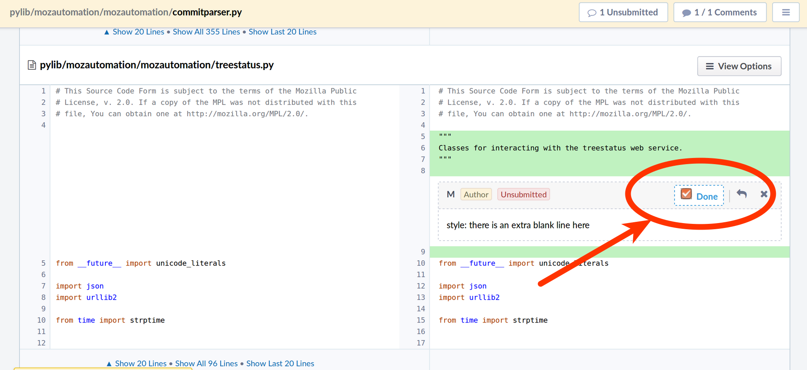
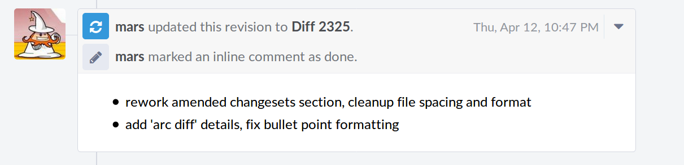
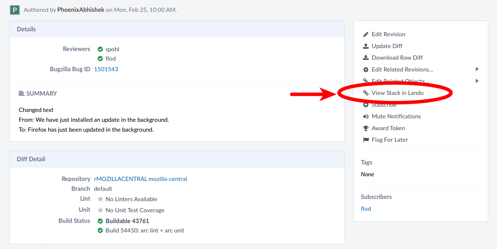
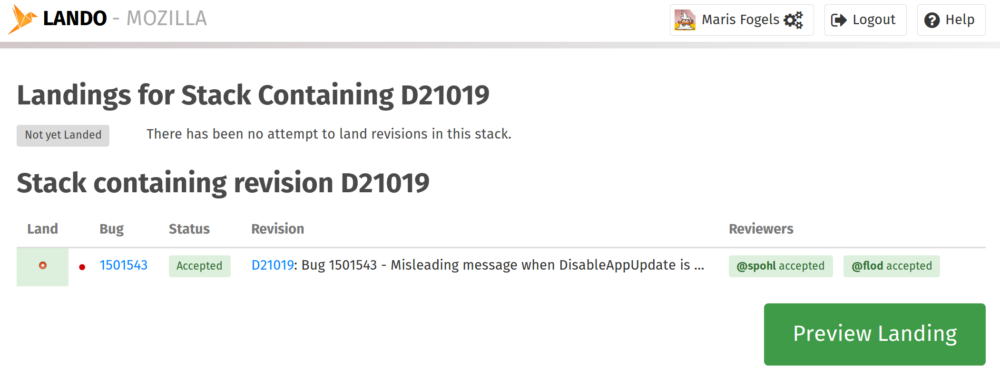

************
Introduction
************

Mercurial Setup
===============

.. TODO link to the main phab doc

Multi-Head vs. bookmarks
========================

While some developers use bookmarks/etc to track changes, it's possible to just create a new "head", which essentially means "just start coding off tip and commit".  The ``hg wip`` alias provides a view of the repository that allows for keeping track of the work.

.. FIXME: wording
.. FIXME: include link to https://mozilla-version-control-tools.readthedocs.io/en/latest/hgmozilla/workflows.html#to-label-or-not-to-label ?

***************
Getting Started
***************

Style 1: One review per head
============================

In this style we use GitHub-style fix-up commits under a single head.  The fix-ups will be squashed into a single commit before landing.

We'll use:

* One review
* Multiple fix-up commits under one head

Fixing the code
---------------

Let's start with a clean checkout.

::

  $ hg wip
  @  5865 tip @ autoland: configure lando s3 bucket (bug 1448051).
  |
  ~

  $ vim pylib/mozautomation/mozautomation/commitparser.py
  $ hg status
  M pylib/mozautomation/mozautomation/commitparser.py

Make sure our commit message is well-formatted.

* We do not need a bug number or "r?" reviewers list.  Lando will add this automatically.

::

  $ hg commit
  Fix pep8 lint

  Fix some PEP 8 lint in the module level docstrings.

Oops, we found a second file to update.  We can add a fix-up commit to the head that adds the new changes.

::

  $ vim pylib/mozautomation/mozautomation/treestatus.py
  $ hg commit -m 'docstring for the treestatus module'
  $ hg wip
  @  5871 tip docstring for the treestatus module
  o  5870 Fix pep8 lint
  o  5865 @ autoland: configure lando s3 bucket (bug 1448051).
  o  5864 hgmo: upgrade ZooKeeper to 3.4.11 (bug 1434339) r=sheehan
  o  5863 autoland: configure lando pingback url (bug 1445567) (fixup)
  |

Requesting a Review
-------------------

Before we request a review we should check for changes upstream.

::

  $ hg pull --rebase

* If you want to look before you leap in with ``arc diff`` or ``arc land``, you can run ``arc which`` to get a description of what ``arc`` is going to do next.

We need to include:

* A real BMO Bug #
* Reviewers

The Summary, Test Plan, and Subscribers sections are optional.

::

  $ arc diff
  Fix pep8 lint

  Summary:

  Fix some PEP 8 lint in the module level docstrings.

  Test Plan: $ pep8 thefiles

  Reviewers: glob, imadueme

  Subscribers:

  Bug #: 5556555

  # NEW DIFFERENTIAL REVISION
  # Describe the changes in this new revision.
  #
  # Included commits in branch default:
  #
  #         153ddf055585 docstring for the treestatus module
  #         c7ab40d66585 Fix pep8 lint
  #
  # arc could not identify any existing revision in your working copy.
  # If you intended to update an existing revision, use:
  #
  #   $ arc diff --update <revision>

Addressing feedback
-------------------

Our reviewers came back with some changes.  Let's add some fix-up commits for the work.

::

  $ hg wip
  o  5871 tip docstring for the treestatus module
  o  5870 Fix pep8 lint
  @  5865 @ autoland: configure lando s3 bucket (bug 1448051).

  $ hg checkout 5871
  $ vim pylib/mozautomation/mozautomation/treestatus.py
  # hack hack
  $ hg commit -m 'fix lint'

Check off the Done item in the Phabricator UI.

Now run ``arc diff``.  Phabrictor will automatically submit your Done items in the UI and create a nicely formatted update.

::

  $ arc diff

Landing the changes
-------------------

Everything looks good: the reviewers have approved our changes.  Let's land our changes in mainline.

On your revision page in Phabricator click the "View in Lando" link in the right-hand menu:

You will be taken to the Lando revision overview page.  Give the change one last review, double-check the commit message, etc., before hitting the "Land" button.

Hit the "Land" button and Lando will automatically commit your changes to mainline.

Style 2: One changeset per review
=================================

In this style we craft just one commit per review.  When we get feedback or fixups we amend our single commit.

We'll use:

* One commit
* One review request per commit
* ``hg amend`` to add fix-ups to our commit

Fixing the code
---------------

Let's start with a clean checkout.

::

    $ hg wip
    @  5865 tip @ autoland: configure lando s3 bucket (bug 1448051).
    |
    ~

    $ vim pylib/mozautomation/mozautomation/commitparser.py

    $ hg status
    M pylib/mozautomation/mozautomation/commitparser.py

Make sure our commit message is well-formatted.

* We do not need a bug number or "r?" reviewers list.  Lando will add this automatically.

::

    $ hg commit

Requesting a Review
-------------------

Before we request a review we should check for changes upstream.

::

    $ hg pull --rebase

* If you want to look before you leap in with ``arc diff`` or ``arc land``, you can run ``arc which`` to get a description of what ``arc`` is going to do next.

We need to include:

* A real BMO Bug #
* Reviewers

The Summary, Test Plan, and Subscribers sections are optional.

::

    $ arc diff
    Fix pep8 lint

    Summary:

    Fix some PEP 8 lint in the module level docstrings.

    Test Plan: $ pep8 thefiles

    Reviewers: glob, imadueme

    Subscribers:

    Bug #: 5556555

    # NEW DIFFERENTIAL REVISION
    # Describe the changes in this new revision.
    #
    # Included commits in branch default:
    #
    #         153ddf055585 docstring for the treestatus module
    #         c7ab40d66585 Fix pep8 lint
    #
    # arc could not identify any existing revision in your working copy.
    # If you intended to update an existing revision, use:
    #
    #   $ arc diff --update <revision>

Addressing feedback
-------------------

When it's time to address feedback we use ``hg amend``.

* ``hg commit --amend`` also works, and allows you to update the commit description while amending the commit

::

    $ hg wip
    o  5870 tip Fix pep8 lint
    @  5865 @ autoland: configure lando s3 bucket (bug 1448051).
    o  5864 hgmo: upgrade ZooKeeper to 3.4.11 (bug 1434339) r=sheehan
    o  5863 autoland: configure lando pingback url (bug 1445567) (fixup)
    |

    $ hg checkout 5870
    $ vim pylib/mozautomation/mozautomation/commitparser.py
    # hack hack
    $ hg amend

Check off the Done item in the Phabricator UI.

Now run ``arc diff``.  Phabrictor will automatically submit your Done items in the UI and create a nicely formatted update.

::

    $ arc diff

Landing the changes
-------------------

Everything looks good: the reviewers have approved our changes.  Let's land our changes in mainline.

On your revision page in Phabricator click the "View in Lando" link in the right-hand menu:

You will be taken to the Lando revision overview page.  Give the change one last review, double-check the commit message, etc., before hitting the "Land" button.

Hit the "Land" button and Lando will automatically commit your changes to mainline.

