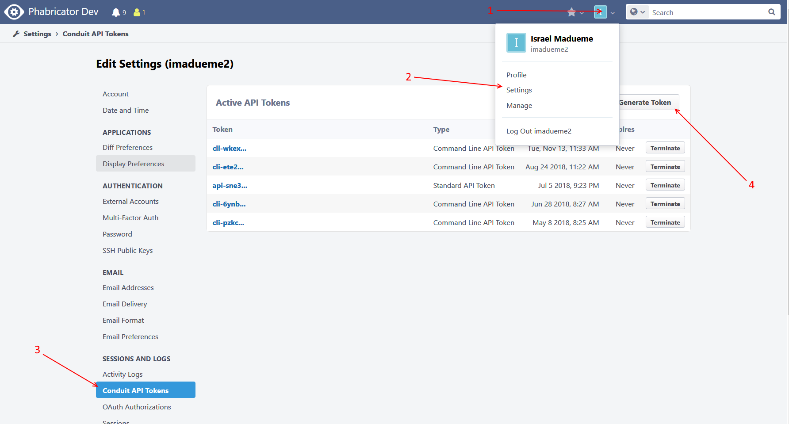
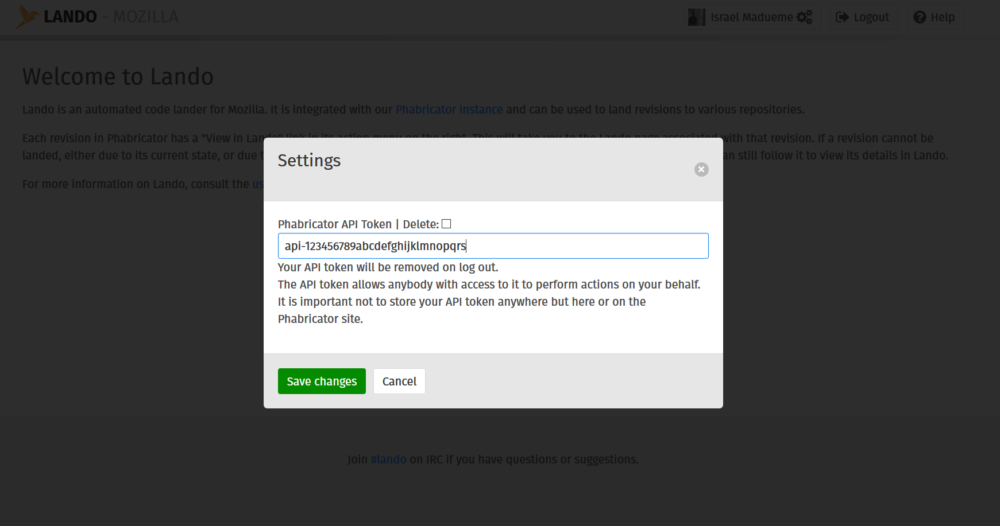
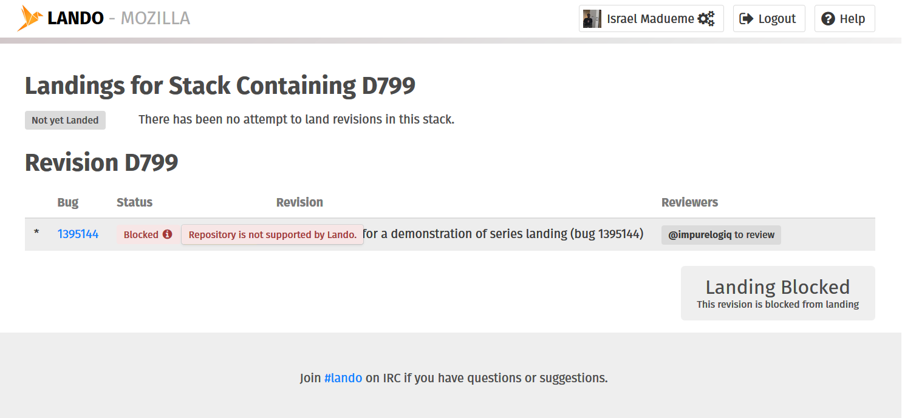
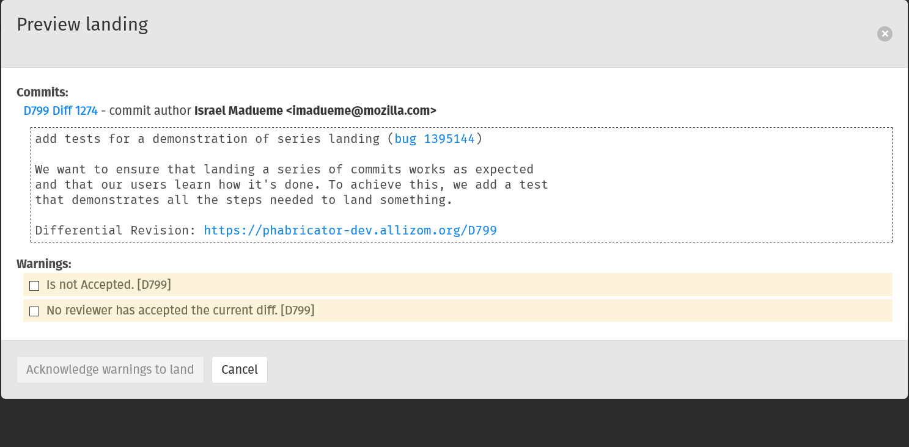
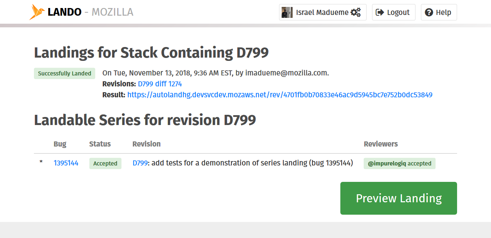
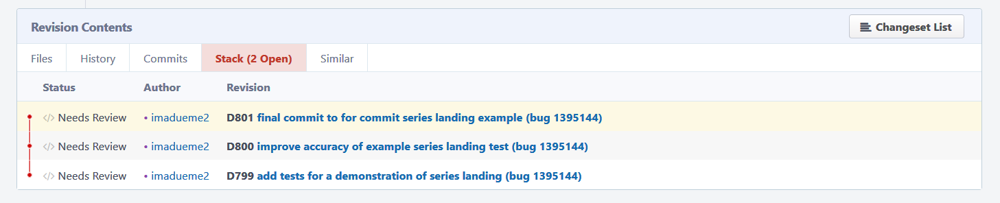
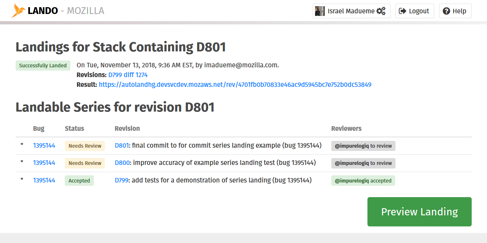

################
Lando User Guide
################

***********
About Lando
***********

Lando is Mozilla's new automatic code-landing service.  It is loosely
integrated with our `Phabricator instance
<https://phabricator.services.mozilla.com>`_.  Its purpose is to
easily commit Phabricator revisions to their destination repository.

******************
Viewing a Revision
******************

All revisions in Phabricator have a "View in Lando" link.  If the
revision has been accepted (approved), the link will be active;
otherwise, it will be greyed out.  An active link looks like the
following:

.. image:: images/view-in-lando.png
   :align: center
   :alt: Screenshot of a Phabricator Revision ready to land with Lando

Clicking this link will take you to the Lando page for that revision:

.. image:: images/lando-land-it.png
   :align: center
   :alt: Screenshot of a revision in Lando that is ready to land

You can also go directly to a revision's Lando page by specifying the
revision ID in the Lando URL:
``https://lando.services.mozilla.com/D<rev number>/``.

A relevant set of metadata about the revision is presented, including
the revision ID, the author, the status of reviews, and the commit message.
There is also a timeline of previous landing attempts, if any.

*******************************
Viewing a confidential revision
*******************************

Lando can view and land secure Phabricator revisions that you have access to.

If you try to view a secure revision on Lando without proper setup, you will
see an error page telling you that the revision could not be found, or it is
locked down. To view it, you'll need to provide Lando with a Phabricator API
token for your account.

First, generate a Phabricator api token. Go to Settings -> Conduit API Tokens ->
Generate Token. Keep this token secret and use it only for Lando. You cannot
reuse a 'cli-' token, please generate a new api token (these start with 'api-').

Next go to Lando and click the settings icon next to your name, near the logout
button. Once clicked, a settings modal will be displayed and you can enter the
Phabricator API token you generated here.

Click save and then try to load the secure revision page on Lando again.

To delete an api token, check the 'Delete' checkbox on the settings modal and
click save. Or you can simply Logout.

******************
Landing a Revision
******************

You must be logged in to initiate a landing.  Logins are handled by
Auth0 and follow the same flow as many other Mozilla systems.

In addition to logging in, the following conditions must be true:

* The revision must be associated with a repository in Phabricator.
* A destination repository must be configured in Lando. Ask in the #lando
  channel on irc.mozilla.org for help if you get this error.
* You must have the required SCM permissions to land to the
  destination repo (e.g. ``scm_level_3`` for ``mozilla-central``).
  See the `FAQ <https://wiki.mozilla.org/Phabricator/FAQ#Lando>`_
  for help with this error.
* Your permissions for the repo must be active (i.e. not expired).
* A landing for this revision must not already be in progress.
* You are not attempting to land an old diff of a revision that was updated.

When you preview the landing, if any of the above are not true, you will be
shown an appropriate error message at the bottom of the page, and the "Land"
button will be disabled.

If there are no landing blockers, you can click the "Preview Landing" button to
see a preview before landing. Here you can verify the final commit message as
well as acknowledge any warnings.

Warnings are things which Lando suspects could be a problem, but, will allow you
to determine if it really is, e.g.: the revision has already been landed
previously, or the revision has not been accepted by a blocking reviewer.
You can acknowledge these warnings by checking the checkboxes next to them if
you believe the landing should proceed regardless.

Once "Land" is clicked, a request will be queued.  Generally, this
will execute quickly, but if there are a lot of pending landings, or
if the trees are closed, it may take longer.  The landing request will
stay in the queue until it is executed.

Once the landing is executed, the timeline will be updated with the
results:

.. note:: Lando pages do not currently automatically refresh; you will
          have to reload them manually to see updates.  There are a couple
          bugs open to fix this: `bug 1460364
          <https://bugzilla.mozilla.org/show_bug.cgi?id=1460364>`_ and
          `bug 1456197 <https://bugzilla.mozilla.org/show_bug.cgi?id=1456197>`_.

If the landing failed, an error message will be displayed.  This error
may represent a problem with the revision, e.g. a merge conflict.  In
this case, the revision will have to be updated and resubmitted.  If
it appears to be an error with Lando itself (or related services),
please let us know in #lando on IRC or `file a bug
<https://bugzilla.mozilla.org/enter_bug.cgi?product=Conduit&component=Lando>`_.

****************************
Landing a stack of revisions
****************************

Lando can also land a stack of revisions at once.

Ensure that the dependency chain is properly set in Phabricator:

Load the child-most commit of the stack you want to land. For example, in this
case we would load D799 to only land D799, or load D800 to land D799 and D800,
or load D801 to land all 3 revisions. Once loaded in Phabricator, click the
"View stack in Lando" link in the sidebar.

The resulting page will show you information for each revision in the stack. The
timeline can show partial landings of a subset of the stack, as demonstrated in
the screenshot above (D799 was landed, but D800 and D801 have not yet been landed).
The same principles for landing a single revision apply for landing a stack;
you will get a warning or confirmation when previewing the landing and a
success or failure result after landing.

.. note:: If there are any confidential revisions in the stack that you want to
          view, you must have permission to view all of them. Make sure to set
          a Phabricator API token on Lando if this is the case.

**************************
Frequently Asked Questions
**************************

See the FAQ `on the wiki
<https://wiki.mozilla.org/Phabricator/FAQ#Lando>`_ for answers
to common questions and issues.  The FAQ is on a wiki to make it
easier to maintain; please feel free to update it if you come across
other frequently asked questions!
