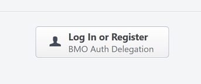
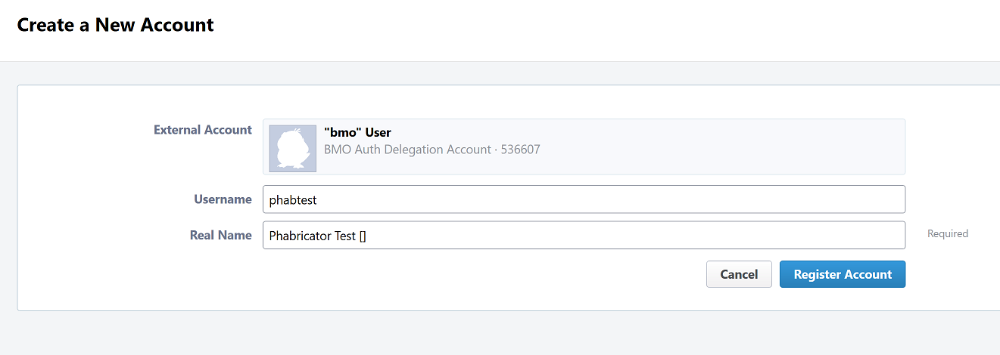
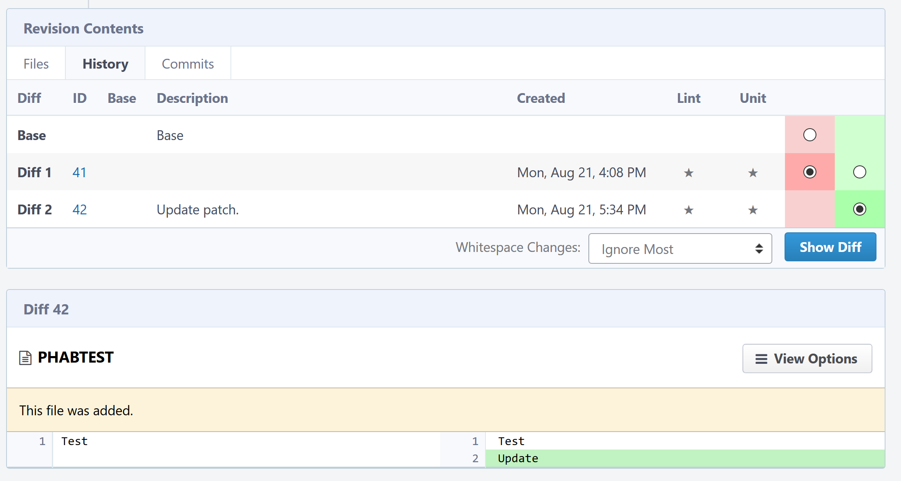
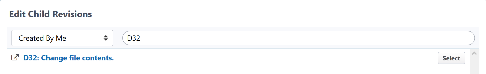
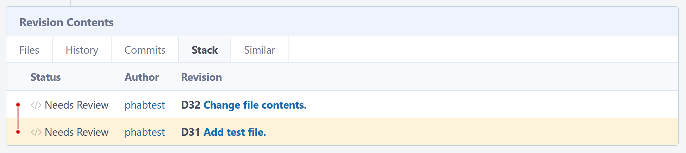

##############################
Mozilla Phabricator User Guide
##############################

**********
User Guide
**********

As Mozilla's Phabricator instance has only small modifications from
stock Phabricator, much of `Phabricator's user documentation
<https://phabricator.services.mozilla.com/book/phabricator/>`_ is fully
applicable.  Several sections are of particular interest.

**Arcanist** is the command-line interface to Phabricator, mainly used
to submit patches for review.  There is an `Arcanist Quick Start guide
<https://phabricator.services.mozilla.com/book/phabricator/article/arcanist_quick_start/>`_,
a larger `Arcanist User Guide
<https://phabricator.services.mozilla.com/book/phabricator/article/arcanist/>`_,
and a specific `guide to "arc diff"
<https://phabricator.services.mozilla.com/book/phabricator/article/arcanist_diff/>`_
available in the main Phabricator documentation.  There are also other
related articles available under the `Application User Guides
<https://phabricator.services.mozilla.com/book/phabricator/>`_.

**Differential** is Phabricator's code-review tool.  Useful articles
include the `Differential User Guide
<https://phabricator.services.mozilla.com/book/phabricator/article/differential/>`_,
the `FAQ
<https://phabricator.services.mozilla.com/book/phabricator/article/differential_faq/>`_,
and the `Inline Comments guide
<https://phabricator.services.mozilla.com/book/phabricator/article/differential_inlines/>`_.
As usual, there are other articles available for specific subjects.

Another useful application is **Herald**, which can perform actions,
such as sending notifications, based on object changes (such as a
Differential revision being created or updated).  There is a short
`user guide
<https://phabricator.services.mozilla.com/book/phabricator/article/herald/>`_
available.

.. _quick-start:

***********
Quick Start
***********

Creating an Account
===================

The first step toward submitting a patch via Phabricator is to create
an account.  Visit our Phabricator instance at
https://phabricator.services.mozilla.com/ and click the "Log In" button
at the top of any page.

You'll be taken to another page with a single button, which will in
turn take you to `bugzilla.mozilla.org
<https://bugzilla.mozilla.org>`_ (BMO) to log in or register a new
account.

After you've done so, you'll be redirected back to Phabricator, where
you will be prompted to create a new Phabricator account.  On this
form, the "Real Name" field is taken from your BMO account's real
name.  If your BMO real name also contains the ``:<ircnick>``
convention, that is, a username starting with a colon, it will be
extracted and placed into the Phabricator account's username field.
Common surrounding punctuation, e.g. parentheses (``()``) and brackets
(``[]``) will be stripped out and discarded.  If you've used some
other way to separate or emphasize your username, you'll have to
remove the extraneous characters from the Real Name field manually
before clicking "Register Account".  The following screenshot shows
the account-creation form, with default values, for a BMO user with
the real name "Phabricator Test [:phabtest]".

Note that the username field is mandatory, so if you didn't have one
automatically filled in, you'll have to pick one.

.. important:: The username field is unique.  You should pick a
   clearly identifiable username, particularly if you will be doing
   code reviews, such as your nick on irc.mozilla.org.  If your nick
   is not available but you think it should be because, for example,
   you are at least somewhat known in the Mozilla community, please
   `file a bug
   <https://bugzilla.mozilla.org/enter_bug.cgi?product=Conduit&component=Administration>`_
   or let us know in #phabricator on irc.mozilla.org.

.. todo:: are we really keeping 2FA on?

You now have a Phabricator account set up and can both submit and
review patches (along with using the other Phabriator applications).

Setting up Arcanist
===================

Although you can submit patches via the web interface, the preferred
method is to use Arcanist, the Phabricator command-line tool.
Installing the tool depends on your operating system; see the
`Arcanist Quick Start guide
<https://phabricator.services.mozilla.com/book/phabricator/article/arcanist_quick_start/>`_.
Note that in Windows 10, you can use the Linux-based instructions if
you are running the `Windows Subsystem for Linux
<https://msdn.microsoft.com/en-us/commandline/wsl/about>`_.

On Ubuntu, you will need PHP and an extension installed: ``sudo apt
install php php-curl``.  Then clone the Arcanist repos as described in
the Quick Start guide linked above, and add the ``arcanist/bin/``
directory to your path.  Note that you can also install the Arcanist
apt package, but you may not get recent fixes and improvements.

If your project does not currently have a ``.arcconfig`` checked into
the its repository, you can create one locally, which should look like
this::

    {
      "phabricator.uri" : "https://phabricator.services.mozilla.com/"
    }

The next step is to authenticate Arcanist with our Phabricator
installation.  From within your project's repository, run the
following command::

    $ arc install-certificate

This will prompt you to visit a page on our Phabricator instance, which
will generate an API key for you to paste into your terminal.  The
key is stored in the file ``.arcrc`` in your home directory.

Submitting Patches
==================

There are a few ways to use Arcanist and Differential.  We'll cover
two common use cases: fix-up commits, which is somewhat similar to
GitHub's process, and amended commits, which is similar to MozReview's
model.

.. _initial-patch:

The Initial Patch
-----------------

Submitting the initial patch is the same in both processes.  First,
commit a change.  Here's an example::

    $ echo "Test" > PHABTEST
    $ hg add PHABTEST && hg commit -m "Add test file."

Then create a revision in Differential::

    $ arc diff

You'll be taken to an editor to add extra details.  Your commit
message will be used to create the revision title and summary.  The
other fields are optional with the exception of ``Bug``, which must be
set to a valid BMO bug number.  Unfortunately, a limitation of
Phabricator currently prevents us from seeding this field with a bug
ID from the commit message (at least from the first line, where bug
IDs are usually mentioned in mozilla-central changesets); however, we
may be able to work around this by implementing a ``mach`` command
that wraps ``arc``.

You may want to add a reviewer, which should be a Phabricator username
(e.g. ``mcote``).  You can also add one or more subscribers, who will
be notified of updates to the revision.

After you exit the editor, the revision should be created.  Here's
example output using our development instance::

    Created a new Differential revision:
            Revision URI: https://mozphab.dev.mozaws.net/D29

    Included changes:
      A       PHABTEST

If you visit the revision at the provided URL, you will see that it is
labelled "Needs Review", which is the default state of a newly created
revision.  It will also be marked "Public", unless the bug ID you
entered is a confidential bug to which you have access.  For
convenience, an attachment is created on the bug containing just the
URL to the new revision, with the description being the revision's
title.  Finally, you will also see a few actions on the revision,
which are automatically performed by our BMO-integration code.  For
more on Phabricator-BMO integration, see :ref:`bmo-integration`.

.. _fix-up-commits:

Fix-Up Commits
--------------

After your patch has been reviewed, you may have to update your patch
and get another round of reviews.  As mentioned, there are two ways to
do this in Differential.

The "fix-up commit" model involves creating a new commit containing
the updates.  This is similar to GitHub's standard process.  You will
end up with a series of commits that should be "squashed" into a
single commit before landing, since the fix-up commits are not useful
history once a change has landed.

Here's an example that adds another line to our test file from above::

    $ echo "Update" >> PHABTEST
    $ hg commit -m "Update patch."

Submitting the change to Differential is the same command::

    $ arc diff

Your editor will again be opened, but this time the format is much
simpler.  You just need to provide a change summary, which again is
automatically seeded from your commit message.  Arcanist should also
have determined which revision to update.  If for some reason it was
not able to, you can use the ``--update`` option to specify a
revision ID.

After the update has been submitted, you will see output similar to
this::

    Updated an existing Differential revision:
            Revision URI: https://mozphab.dev.mozaws.net/D29

    Included changes:
      A       PHABTEST

Going to the revision's URL will show the change in the activity log.
There will also be new entries in the "History" and "Commits" tabs in
the "Revision Contents" table.  You can use the History tab to switch
between various diff views: the current patch, the patch at a
particular point in history, and the changes between different
commits, i.e., an interdiff.  Here are the changes between the first
and second commit ("Diff 1" and "Diff 2" in Phabricator language):

Amended Commits
---------------

The other method for updating patches is to amend the commits in
place.  This is similar to MozReview's standard process.

Starting from the end of the above section, :ref:`initial-patch`,
rather than creating a new commit, we amend the existing commit, like
so::

    $ echo "Update" >> PHABTEST
    $ hg commit --amend

After running ``arc diff``, an editor is again opened for a change
summary, although this time there is no new commit message to use, so
we must enter one manually.  Once the update is processed, the
revision looks very similar to the revision with fix-up commits,
except the "Commits" tab of the "Revision Contents" table has only a
single entry.  The "History" tab, however, is identical to the fix-up
commits scenario, with "Diff 1" and "Diff 2" entries, and the same
ability to see the different patches and differences between them.

.. _series-of-commits:

Series of Commits
-----------------

It is possible to chain a series of revisions together in
Differential, although it is currently a manual process.  This feature
can be used to represent a stack of commits to split up a complicated
patch, which is a good practice to make testing and reviewing easier.

To use this pattern, you will need to specify the exact commit you
want to send to Differential, since the default is to send all your
draft commits to a single revision, i.e., the :ref:`fix-up-commits`
method, which is not what we want here.  To send only the currently
checked-out Mercurial commit, run the following::

    $ arc diff .^

To set the parent-child relationship, you can use the UI or put a
directive into the child's commit message.  To use the UI, go to your
first commit, choose "Edit Related Revisions..." from the right-hand
menu, then "Edit Child Revisions".  Your child revision may be
suggested, or you can enter an ID into the search box, including the
``D`` to denote a differential revision, e.g. ``D32``:

Select the appropriate revision and click "Save Child Revisions".  The
"Revision Contents" table will now have a new tab, "Stack", which
shows the current stack of revisions:

You can also add ``Depends on D<revision ID>`` to the child's commit
message, replacing ``<revision ID>`` with the ID of the parent
revision.  The relationship will be created when ``arc diff`` is run.

Unfortunately there is not currently a way to see a combined diff of
all the stacked commits together without applying the commits
locally.  Also, when you update any commits, you'll need to run ``arc
diff .^`` for each child commit as well.

See also this `blog post
<https://smacleod.ca/posts/commit-series-with-phabricator/>`_ on
working with commit series in Phabricator.

We will be working on a solution to automate the submission and
updating of commit series.

Reviewing Patches
=================

Pulling Down Commits
--------------------

You can pull down the commits from any revision you have access with
this command::

    $ arc patch <revision id>

It is helpful to understand that ``arc patch``, by default, will not attempt to
patch the revision on top of your current working set. Instead, it applies the
changes on top of the same parent commit the author used and creates a new
commit and a new branch (git) or bookmark (hg). If it cannot find the same
parent commit in your local repo then it will warn you and give you the option
to apply it on top of the current working set. If you wish to test a revision
on top of your current working set use ``arc patch --nobranch``.

If you have a stack of revisions (see above section
:ref:`series-of-commits`), the commits from all previous revisions
will be applied as well.  Note that if you are pulling down a stack of
revisions but have a different commit currently checked out than was
used as the parent of the first commit, you will get warnings like
this::

    This diff is against commit a237e16c2f716f55a22d53279f3914a231ae4051, but
    the commit is nowhere in the working copy. Try to apply it against the
    current working copy state? (.) [Y/n]

This is because the first commit now has a different parent and hence
a different SHA.  You can avoid this problem by updating to the parent
of the first commit before running ``arc patch``.

Leaving Reviews
---------------

Performing a review involves two steps, both of which are technically
optional but will usually be used together:

1. Leaving comments on the diff and/or on the revision generally.
2. Choosing an action to indicate the next step for the author.

Leaving comments is fairly straightforward.  For inline diff comments,
click on the line number where you want to leave a comment, and enter
some text.  The text editor is quite rich; you can use many styling
and formatting tools.  Below the diff is another text-entry box, which
can be used for general comments ("Looks good to me", "Here are some
suggestions for your overall design", etc.).

At this point you can click the "Submit" button at the bottom;
however, this will leave the review open.  You might want to do this
if you have some preliminary comments and plan to give a more detailed
review later.  However, usually you will want to use the "Add
Action..." dropdown to signal a clear intent to the revision author
and to communicate what they should do next.  These actions include:

* **Accept Revision**: The diff is good as it is and can be landed.
* **Request Changes**: The diff needs some changes before it can be
  landed.  Specific change requests should be left as comments, as
  described above.
* **Resign as Reviewer**: This indicates that you are not able to or
  do not wish to review this change.  You will be removed from the
  reviewers list and hence will not get notifications of updates to
  the revision.  You should explain in a comment why you are resigning
  (e.g. going on vacation soon, not your area of expertise, etc.) and
  ideally a substitute reviewer or other action for the author to
  take, if there are no longer sufficient reviewers on the revision.

***************
Landing Patches
***************

For Mercurial repositories, in particular `mozilla-central
<https://hg.mozilla.org/mozilla-central>`_, we highly recommend using
:doc:`Lando </lando-user>`.  See :ref:`getting-in-touch` to have
repositories added to Phabricator and Lando.

If you cannot use Lando, e.g. for :ref:`confidential revisions
<confidential-revision-warning>`, we highly recommend manually landing
to mozilla-inbound without the use of ``arc patch`` nor ``arc land``,
both of which add metadata to the commit message which may not be
desirable, such as the list of revision subscribers.

If you do not have the commit applied locally (e.g. you are landing
someone else's patch), you can use the "Download Raw Diff" link, found
in the right-hand menu on the revision, and apply it as usual with
``patch``.  If you have Arcanist installed, you could also run ``arc
patch --nocommit --skip-dependencies D<revision id>``.  This will
apply the diff locally but not commit it, nor will it apply any
parents.  You can then commit it manually, using the revision title as
the first line of the commit message and the Summary field as the body.

Conversely, for repositories other than mozilla-central, the
amendments Phabricator makes to commit messages may in fact be useful.
If you are the author of a patch, you can use ``arc land``, which will
update the commit message with revision metadata, including reviewers
and revision URL, rebase your commit onto the master branch (Git) or
default head (Mercurial), and automatically push the commits to the
destination repository.

If you are landing someone else's patch, you can run ``arc patch
D<revision id> --nobranch`` first to apply the commit(s) locally
(``--nobranch`` ensures the commits are applied to the current
branch/head).  You can then run ``arc land`` or just push the commits
as usual.

****************
Our Installation
****************

Mozilla's Phabricator instance is a stock installation, with a small patch
applied, and some custom extensions.  The patch and extensions are
intentionally small in scope and are limited to supporting integration
points with `bugzilla.mozilla.org <https://bugzilla.mozilla.org>`_
("BMO").

See :ref:`conduit-repos` for the location of our source code.

************
Applications
************

Phabricator is actually a suite of many applications, from a
code-review tool to wikis to a blogging platform.  At Mozilla, we
already have existing applications that solve many of these problems.
To prevent the re-emergence of the all-too-common problem of having to
choose between several tools that are all functionally similar, we
have disabled the use of some of these applications.

The default left-side menu in Phabricator lists the most important
applications for Mozilla's use case.  In addition to Differential and
Herald, described above, we support or are trialing several other
applications and utilities:

* **Dashboards** allow users to set up custom pages to display useful
  information, for example assigned reviews.  It seems somewhat
  limited, though, so we'll evaluate how useful it really is.

* **Pholio** is an application for reviewing mock-ups and designs.
  Mozilla doesn't have a central application for this, so we'd like
  your input on whether Pholio is useful.

* **Badges**, **macros**, and **tokens**: These are mostly bits of
  whimsy that might enhance user experience by providing some levity.
  If they're fun, or at least harmless, we'll leave them; if they
  become annoying or distracting, we may remove them.

Note that Phabricator also has a post-commit review system called
**Audit**.  This application is mandatory, that is, it cannot be
disabled in a Phabricator installation.  However, at the moment
Mozilla has no defined engineering processes for post-commit review of
Firefox and related code, so we do not recommend its use, at least
until such time as a process is deemed necessary and implemented.
Audit may, of course, be useful to projects hosted on the Mozilla
Phabricator instance outside of Firefox.

.. _bmo-integration:

***************
BMO Integration
***************

Since issue tracking and code review are tightly related, and since
BMO is currently the authority for identity and authorization around
both issue tracking and code review, including security and other
confidential bugs and fixes, our Phabricator instance is integrated
with BMO.  This integration is intentionally lightweight in order to
limit customization of Phabricator, which has both maintenance and
opportunity costs.  It consists of identity, authorization, links
between bugs and revisions, and basic review-status mirroring.

Identity
========

As described in the :ref:`quick-start` guide, the main way to log into
Phabricator is via BMO's auth delegation.  A user logging into
Phabricator is taken to BMO to log in as usual and will be redirected
back to Phabricator if the login succeeds.  If this is the first time
the user has logged into Phabricator, they will be prompted to create
an account.  New users will also be prompted to enter a separate
username, unlike BMO.

Authorization
=============

If a bug has one or more security groups applied to it, that is, it
has restricted visibility, any Differential revisions associated with
it are similarly restricted in visibility.  This will initially only
apply to Firefox security groups, that is, groups with names matching
``*core-security*``.  Any revision associated with a bug restricted
via other groups, e.g. infra, is visible only to the author and
admins.  We can add proper support for such groups on request.

Links from Differential to BMO
==============================

A bug number must be entered when a patch is submitted to Phabricator.
This is stored in the revision metadata and provided in the UI as a
link to the associated bug on BMO.

Links from BMO to Differential
==============================

Upon the creation of a new revision in Differential, a stub
attachment, containing only the URL of the revision, is added to the
associated bug.  Based on the attachment type, BMO automatically
redirects to Differential if the attachment link is clicked.

Review flags
============

For simplicity, and since Differential's review system does not map
cleanly to BMO's review flags, r+ flags, and only r+ flags, are set on
the stub attachment associated with a Differential revision when a
Phabricator user performs an "Accept Revision" action.  The flag is
removed if the reviewer later issues a "Request Changes" or a "Resign
as Reviewer" action.  Similarly, all r+ flags are removed if the
author selects any of the "Plan Changes", "Request Review", or
"Abandon Revision" actions.  In the last case, the stub attachment is
also be obsoleted.

******************
Using git-cinnabar
******************

We have developed a special version of ``arc`` for ``git-cinnabar``. It has 
been created to map commit hashes between Mercurial and Git. This allows 
patching a Diff which has been created with ``git-cinnabar`` into Mercurial 
repository and vice versa.

Please install the Arcanist as described in :ref:`quick-start` 
with a change to the location of the arcanist repository::

    $ mkdir somewhere/
    $ cd somewhere/
    somewhere/ $ git clone https://github.com/phacility/libphutil.git
    somewhere/ $ git clone https://github.com/mozilla-conduit/arcanist.git
                                              ^^^^^^^^^^^^^^^

.. _getting-in-touch:

****************
Getting in Touch
****************

If you have questions about our Phabricator installation, you can find
the team in #phabricator on irc.mozilla.com and mozilla.slack.com.
The team also hangs out in #conduit, which is our channel for
development discussions.  Feel free to join if you'd like to help us
out!

Issues can be filed in Bugzilla under the Conduit product.  These are
the main components:

* `Administration
  <https://bugzilla.mozilla.org/enter_bug.cgi?product=Conduit&component=Administration>`_:
  For requests to add new repositories and similar tasks.
* `Documentation
  <https://bugzilla.mozilla.org/enter_bug.cgi?product=Conduit&component=Documentation>`_:
  For issues with these and other project docs.
* `Phabricator
  <https://bugzilla.mozilla.org/enter_bug.cgi?product=Conduit&component=Phabricator>`_:
  For issues with Phabricator, including our extensions (authentication, BMO integration,
  etc.) and with the upstream Phabricator product.  For bugs in our
  extensions, we may move them to
  `bugzilla.mozilla.org :: Extensions: PhabBugz
  <https://bugzilla.mozilla.org/enter_bug.cgi?product=bugzilla.mozilla.org&component=Extensions%3A%20PhabBugz>`_
  depending on where the problem exists in our code.  Also note that, as
  discussed in :ref:`bmo-integration`, we are strictly limiting
  customizations to our instance.  We may, however, work with upstream
  in fixing important issues.
* `Lando
  <https://bugzilla.mozilla.org/enter_bug.cgi?product=Conduit&component=Lando>`_:
  For issues with Lando, the UI/API for requesting and monitoring commit landings.
* `Transplant
  <https://bugzilla.mozilla.org/enter_bug.cgi?product=Conduit&component=Transplant>`_:
  For issues with Transplant, the backend service which takes landing requests from Lando and
  pushes them to the relevant repository.
* `General
  <https://bugzilla.mozilla.org/enter_bug.cgi?product=Conduit&component=General>`_:
  Feel free to file issues here if you aren't sure where they should
  go.  We'll triage them as needed.

**************************
Frequently Asked Questions
**************************

See the FAQ `on the wiki
<https://wiki.mozilla.org/Phabricator/FAQ#Phabricator>`_ for answers
to common questions and issues.  The FAQ is on a wiki to make it
easier to maintain; please feel free to update it if you come across
other frequently asked questions!
